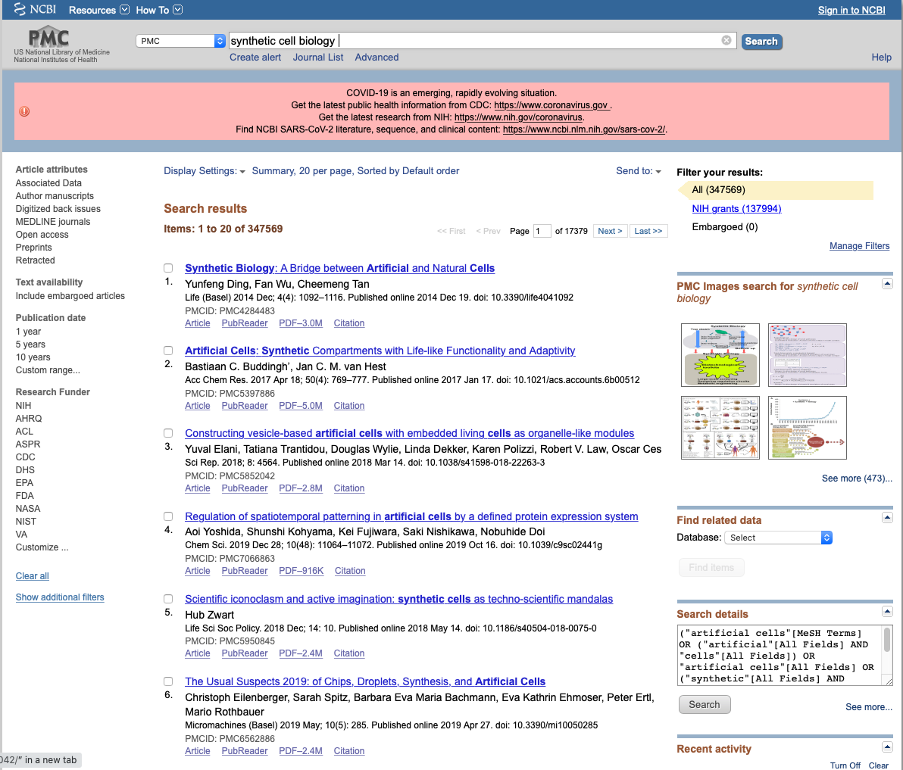
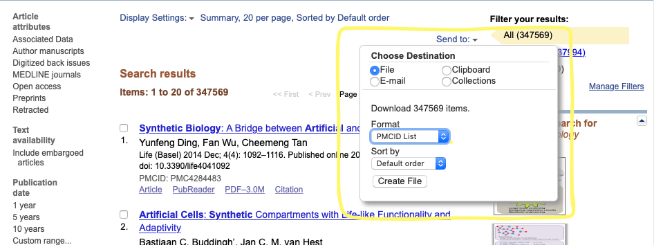
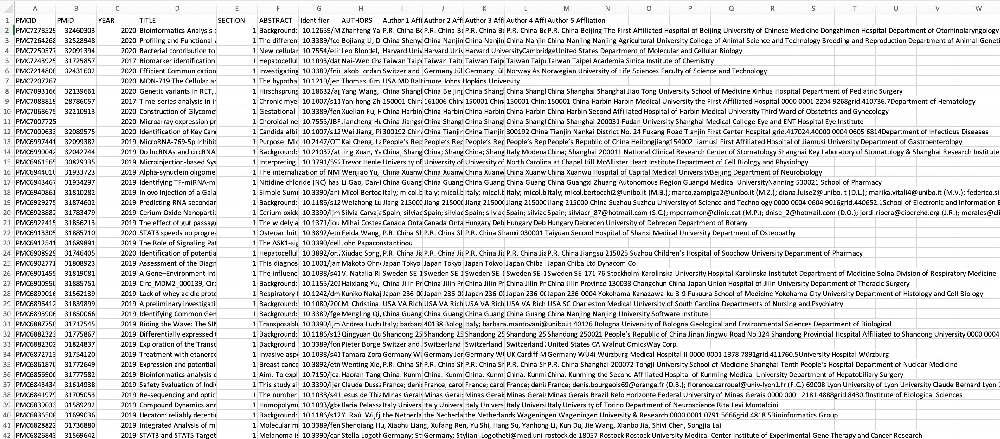

# SURF2020
### By: Pavan Bhat <pavan.bhat@nist.gov>

##### This project was developed for the NIST SURF Program, Summer of 2020.
It includes various programs for 
- getting the abstracts from PMCIDs 
- Formatting the metadata output for easy databse imports
- Formatting R&R Outputs
- Getting Abstracts from PMIDs
- Getting Abstracts from Springer Link
- Getting Spanish and English Abstracts from scielo

## Getting Abstracts From a list of PMCIDs

> 1. To start, go to the [PubMed Central Website](https://www.ncbi.nlm.nih.gov/pmc/)
> 2. Then, type in a term you want to search. You can also filter by year, author, etc. Keep in mind that the more results you get the longer it will take for the next steps, so breaaking up into smaller chunks is recommended.

It should look something like **this**



&nbsp;  


> 3. Now we will get the PMCIDs from the website by clicking on the *Send to* button as shown below



The resulting file (*it may take a while to download*) should have the format:

```
PMC12345
PMC23456
PMC987654
```

#### Getting Abstracts

> 4. Now that we have the list of PMCIDs, we are ready to use the program ***pmc.py***. However, first make sure to download the dependencies.

The dependecies required are listen in requirments.txt navigate to the file in your terminal and run
``` pip install -r requirements.txt ```

> 5. Now that you have the requirements, we are ready to run the program. I would reccomend creating a folder for the output beforehand.

#### Usage

In this example I will have my id file, `'/Users/pavanbhat/Desktop/pmcid.txt'`, and my output folder will be `'/Users/pavanbhat/Desktop/output_folder/'`

General usage can also be found running `python pmc.py -help`, but it is listed below:

```
python pmc.py <input_file> <output_file_stem> <number_of_lines_per_output_file> <Windows = True/False>
```

- *input_file* : The path to the pmcid file collected from PMC Website
- *output_file_stem* : The path to the output folder and the file stem of output file you want (***SEE EXAMPLE***)
- *number_of_lines* : How many lines you want in output CSVs, if there are more IDs than lines per file, the program will create multiple, smaller files
- *Windows* : if on a Windows machine, type ***True***. It is set to False by default.

##### Example

```
python pmc.py /Users/pavanbhat/Desktop/pmcid.txt /Users/pavanbhat/Desktop/output_folder/test_results_ 5000 True
```

> This will create files of 5000 lines named ***test_results_1.csv, test_results_2.csv, etc.*** in the folder *output_folder* on a ***Windows*** machine.

Sample Output will look like this:

> - The "section" is because the abstracts are truncated to be up to 3000 charcters max (while not interrupting sentences) for easier upload into databases. If an abstract is more than 3000 characters, then it will have more than 1 section, with each section having the next part of the abstract. The rest of the information will be the same.

### Conclusion

Once you have the output files, you are done: you now have the abstract for a given PMCID!

#### Errors

POssible erros usually occur because of internet issues. You can tell because the program may have frozen in the output it is printing. One possble fix is to click on the terminal and press `CMD (or Cntrl) + C` which will break the connection. 

If that doesn't work, then terminate the program by closing the terminal. Then look at the CSV file output and go to the last created file and find the last PMCID. Then, in your *ID input file*, delete all PMCs up to that ID, and rerun the program the same way as before. 

***Make sure that your file stem is different though, so you don't overwrite your exisiting files***.


